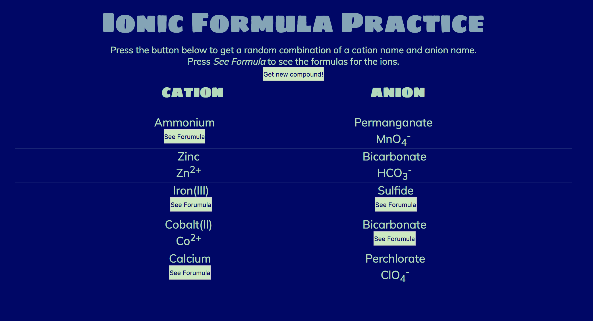
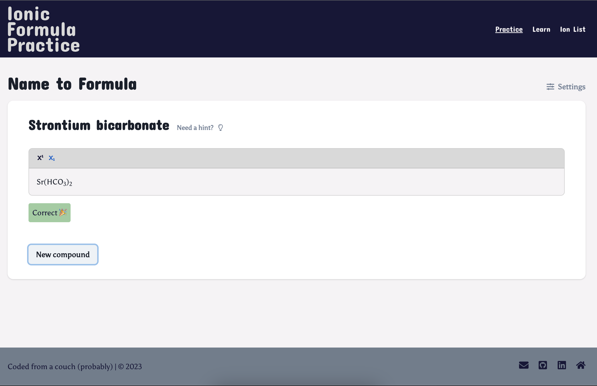

# Ionic Formula Practice

I'm excited to announce the re-launch of a personal project: [Ionic Formula Practice](https://ionic-formula-practice.mikedoescoding.com/). I started on an entire rewrite of the project while I was between jobs. Little did I know that I would take a bit longer to figure out how to get Next.js v13 to build with a rich-text formatting input field. ([QuillJS](https://quilljs.com/) did not play nicely with Next.js v13 while using the app-router.)

## Why Ionic Formulas?

I am a former high school chemistry teacher. One thing that was always difficult to do was create effective worksheets to practice ionic formula writing and naming. In order to have enough resources, I'd have to create several worksheets of: name-to-formula, formula-to-name, monatomic compounds only, polyatomics only, a mix. Yes, yes, yes, there were always guides provided with the textbook. However, a textbook may not be using the same ion list I provided on assessments, so some work to edit the guides was required. This is the resource I wish existed while I was teaching. 

## Alpha Vue Version

In 2018, I launched the first version of the app. Unfortunately, the app was essentially a bare-bones worksheet. There were options to: generate a compound name, see a hint for the cation and anion, and a button to see the completed formula. This type of practice is marginally useful with a couple assumptions: 

1. The student is writing down their answer separately 
2. The student is being honest with themself when the answer is correct/incorrect

In order to build chemistry literacy, there needed to be a way to enter a response and receive feedback. There also needed to be a way to be given formula (or ion) and name it. It is necessary to build a two-way street when it comes to working with and recognizing ions. 

The site was built on [Vue.js](https://vuejs.org/) around v2.x. At the time, I treated the project as a learning opportunity to dive into Vue. To be honest, I did not give Vue a full chance. I figured out what I needed and moved on to the next problem. I never had a real desire to return to Vue when refactoring the site. I was never very happy with the "alpha" version because I knew any teacher would not be able to refer their students to it as a resource. I knew I needed to learn more about web development to create the site I wanted.

## Next.js Version

In this new version, I wanted to include a way for students to engage with the prompt and receive feedback on their answer. For each practice mode, there is a text field that supports subscript and superscript formatting. The answer checker expects to find the correct usage of subscript and superscript. The practice modes include: name-to-formula and formula-to-name. There are also options to practice memorizing only cations and anions. 

To further make this a useful resource for students, the list of ions is easily accessible during the learning modes. I also included learning materials to cover monatomic and polyatomic compounds, transition metal compounds and naming tips. This version of the app is exactly what I would refer my students to if they needed more practice or a refresher before an assessment. 

The new version is built on [Next.js](https://nextjs.org/) v13 with [ChakraUI](https://chakra-ui.com/) for styling. The rich text input is built on top of [TipTap](https://tiptap.dev/introduction). The practice mode is backed by a [Redux Toolkit](https://redux-toolkit.js.org/) store, maintaining state while navigating to the different resources. The entire codebase was migrated to [TypeScript](https://www.typescriptlang.org/) as well, improving type safety and code quality. 

## Final Thoughts

I hope you find [Ionic Formula Practice](https://ionic-formula-practice.mikedoescoding.com/) useful in some way. If you want to see the code, please check out the repo [here](https://github.com/mfrazie2/ionic-formula-practice).  If you know any chemistry teachers, please send them a link to the page. I'd love to hear their [feedback](mailto:mikedoescoding@gmail.com)! 