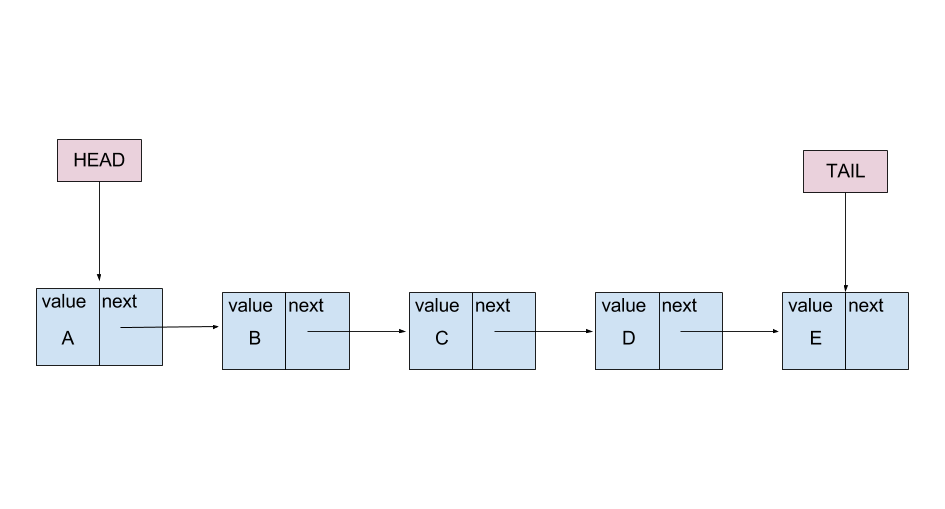
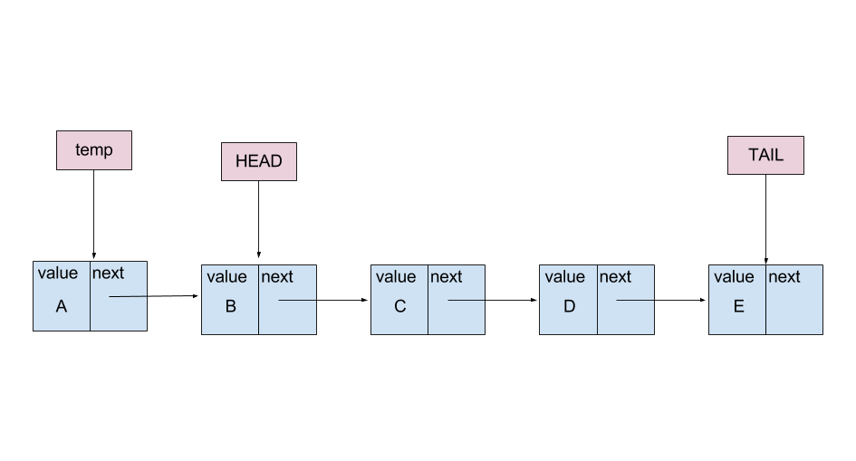
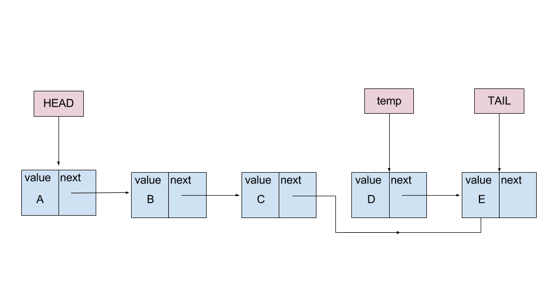

A singly linked list is a type of list data structure. Each node has a `value` key and a `next` key. The `value` key holds information about the node, a number, string, etc. The `next` key holds a reference to the next node in the list. When a node is first created, it is given a `value` for its key (`value : ‘A’`) and its `next` key is `null`. The `next` key remains null until a new node is created and the previous node stores a reference to the new node. In a singly linked list, the nodes store no reference to the previous node.

There are two other important properties when constructing a linked list. There are pointers to first node and the last node called the `head` and `tail`, respectively. Upon the creation of the first node in the list, the `head` points to that node. Consequently, because the first node is also the last node, the `tail` points there as well. When a new node is created, the `tail` points to the new end of the list. It should be noted that the `head` and `tail` only save references to the first and last nodes.

When searching a singly-linked list, the first node to be searched is the one referenced by the `head` object. This guarantees a search always begins at the first node and goes to the last (or until a data match is found).

It is easy to add nodes to the end of the linked list. The node is created; the current end of the list stores a reference to the new node at its `next` key; the `tail` is shifted to point to the last node.
Adding a node to the start of a linked list involves a similar process. Although, this time the new node stores a reference to the current first node at its `next` key and the `head` is shifted to point to the new first node.
The removal of the first node is same process as above but without creating a new node. The `head` is shifted to point to the second node. Although, once the `head` is shifted, there is no way to maintain access to the `value` of the former first node. A reference to it may be made to be used later when its data is required.

To remove a node in the middle of the list is a more complex operation. In the diagram below, the node with a `value` of D is going to be removed. That node cannot be simply deleted because then the previous node, C, would point to nothing, breaking the list. In order for the list to remain intact, C must point to the node following the D, the node with a value of E. Because D stores no reference to C, the operations must be done in the context of node C. Its `next` key of C must point to node E, and node E is stored as a reference on the `next` key of D. Therefore, the `next` key of C points to the reference stored at the `next` key of the node following it. Once that connection is made, node D is now circumvented and no longer a part of the list.

Following this procedure effectively removes node D but its value can no longer be accessed or returned. In order to maintain access, a reference to node D must be made and held in memory until the value is needed.
