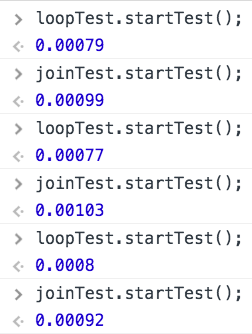

This is the second part of a two-part blog post. The previous post can be found [here](/timing-methods-js). The previous post details a method by which a function can be timed using timers on the `console` object. While the timers do provide us with the time to run a function, we must rerun the function numerous times and record the output values for later analysis. This process can be streamlined and automated using a `SpeedTest` constructor.

The `SpeedTest` should do two things for us. It should be able to run a given function as many times as we choose. It should return the average time in milliseconds it took to run the function.

To begin, the `SpeedTest` will follow the pseudoclassical instantiation pattern. The constructor needs to accept a function to test, the arguments for the function (if necessary) and the number of times the function should be run. The number of times is an optional argument and a default value of 10,000 will be provided.

```javascript
var SpeedTest = function (fnToTest, argsArr, repetitions) {
  this._fnToTest = fnToTest;
  this._argsArr = argsArr;
  this._repetitions = repetitions || 10000;
};
```

There is one method on the `SpeedTest` constructor that invokes the `_fnToTest` as many as times specified by the `_repetitions` property. This method returns the average run time for `_fnToTest`.

```javascript
SpeedTest.prototype.startTest = function () {};
```

The `startTest` method must keep track of the total time required for the `_fnToTest` to run for `_repetitions`. To determine the time for a single invocation, the `Date` function can be used. By getting the `Date` immediately before the function runs and immediately after, the difference is the time for a single run. (This is then repeated.)

Typically the `Date` object is used as follows: `var today = new Date();`, returning the current date (day name, month, day, year, and time). This information is not very useful when it comes to determining the time difference when running a function. By placing a `+` in front of the keyword `new` when invoking the `Date` object, the value is converted into a number. The number represents the time, in milliseconds, since January 1, 1970. At the time of writing, `+ new Date(); // 1465944058670` milliseconds have elapsed since Jan. 1, 1970.

```javascript
SpeedTest.prototype.startTest = function () {
  var sum = 0,
    start,
    end;
  for (var i = 1; i <= this._repetitions; i++) {
    start = +new Date();
    this._fnToRun(this._argsArr);
    end = +new Date();
    sum += end - start;
  }

  return sum / this._repetitions;
};
```

The return value from the `startTest` method is the average run-time, which is simply the total time divided by the number of repetitions.

---

Let’s pull in the two functions we want to test. The functions have been refactored slightly to take a single argument array, containing any arguments required for the function.

```javascript
function concatArrayLoop(arr) {
  var arrOfInterest = arr[0];
  var results = '';
  for (var i = 0, len = arrOfInterest.length; i < len; i++) {
    results += arrOfInterest[i];
  }
  return results;
}

function concatArrayJoin(arr) {
  var arrOfInterest = arr[0];
  return arrOfInterest.join('');
}
```

For the functions, the argument array will house a single array at the zero index, `phone = [ 8, 7, 6, ‘-’, 5, 3, 0, 9 ];`.

We create instances of the `SpeedTest` by passing in the function names, an array with the `phone` array, and number of repetitions.

```javascript
var phone = [8, 6, 7, '-', 5, 3, 0, 9];

var loopTest = new SpeedTest(concatArrayLoop, [phone], 100000);
var joinTest = new SpeedTest(concatArrayJoin, [phone], 100000);
```

Finally, we invoke the `startTest` method on each instance and see the average time in the console.

```javascript
loopTest.startTest();
joinTest.startTest();
```



When using the `SpeedTest` constructor, we see that using a `for` loop is faster than using the native `join` method for creating a string from the values in an array.
