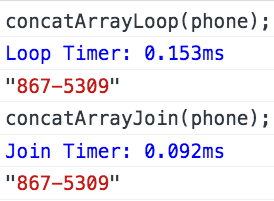

I sometimes wonder how long it takes the interpreter to actually run my code. With the exception of infinitely recursive functions, I don't have a strong idea about the actual computational time required to iterate over an array and build a string versus using a native method on an array, for example. 

In Part 1 of this post, timers in the `console` object will be explored and utilized to test the run time of some code snippets. In Part 2, a `SpeedTest` constructor will be built and used on the same snippets. 

---

Consider the following code block. I encourage you to try this out in your browser. __*Note:*__ I tested the code snippets below in Chrome. Not all of the `console` methods are standard and may not function the same across all browsers.

```javascript 
console.time('Alert Timer'); 
alert('Click OK to Stop Timer');
console.timeEnd('Alert Timer'); 
```

When the snippet runs, a timer is started with the label `'Alert Timer'`. An alert window opens. Clicking OK closes the alert and the timer with the `'Alert Timer'` label ends. The time elapsed between starting the timer and stopping it is logged to the `console` in milliseconds. Waiting longer to click OK causes the elapsed time to be greater. Try it out!


The labels given to `console.time` and `console.timeEnd` are important. These labels **must** be the same, otherwise the timer does not function as expected. This is demonstrated in the examples below.


If there is a `console.time` missing a closing `console.timeEnd` with the same label, its time will continue to run until a `console.timeEnd` with the appropriate label appears.

---

Let's apply the timers to different methods of concatenating all the members of an array into a string. 

```javascript
function concatArrayLoop (arr) {
  var results = '';
  for (var i = 0, len = arr.length; i < len; i ++) {
    results += arr[i];
  }
  return results;
}

function concatArrayJoin (arr) {
  var results = '';
  results = arr.join('');
  return results;
}
```

The two functions appear similar. `concatArrayLoop` uses a `for` loop to concatenate the array members onto the `results` output. `concatArrayJoin` uses the native `.join` method to concatenate the array members and assign the string to the `results` output. The two functions produce the same output for a given input. 

```javascript
var phone = [ 8, 6, 7, '-', 5, 3, 0, 9 ];

concatArrayLoop(phone); // > '867-5309'

concatArrayJoin(phone); // > '867-5309'
```

In order to determine which method is faster, looping or using a native method, timers need to be added to the functions surrounding the lines of interest. Those are shown below.

```javascript
function concatArrayLoop (arr) {
  var results = '';
  console.time('Loop Timer');
  for (var i = 0, len = arr.length; i < len; i ++) {
    results += arr[i];
  }
  console.timeEnd('Loop Timer');
  return results;
}

function concatArrayJoin (arr) {
  var results = '';
  console.time('Join Timer');
  results = arr.join('');
  console.timeEnd('Join Timer');
  return results;
}
```

With the timers added, the run times can be compared. 



The `for` loop takes *slightly* longer than the native `.join` method. However, running the functions once doesn't offer much in the way of meaningful insight regarding which is, on average, faster. 

In order to determine the average time, the output times must be recorded manually. The times are not returned and cannot be assigned to a variable, such as `sum`. This is problematic as we would want to run the function hundreds, thousands, or tens of thousands of time to get a more accurate value for an average run time. 


Timers on the `console` object offer some insight into the run time for a code snippet. However, they leave much to be desired when wanting to run a snippet numerous times. 

In the next part, a `SpeedTest` constructor will be built and used to more accurately measure the average run time for the two functions above. 